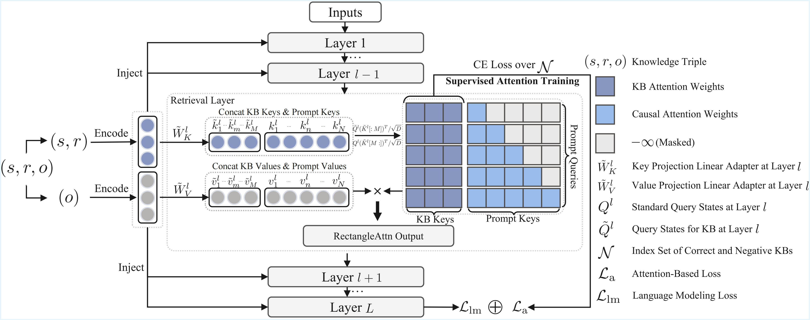
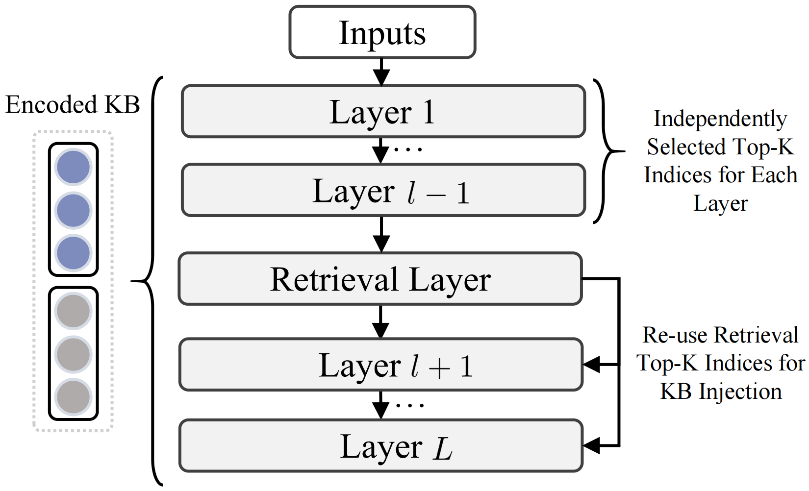
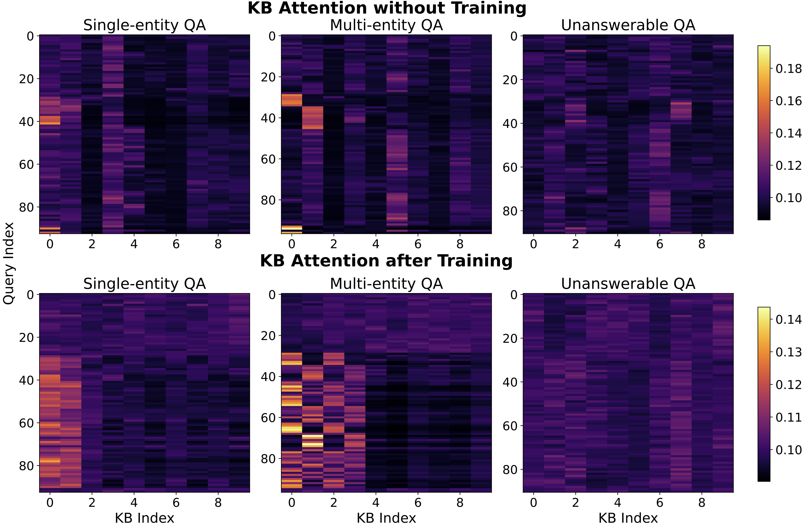

# SR-KI:  Scalable and Real-Time Knowledge Integration into LLMs via Supervised Attention [AAAI 2026]

<p align="center">
  <a href="https://arxiv.org/abs/2511.06446">
    
  </a>
  <a href="https://arxiv.org/pdf/2511.06446.pdf">
    
  </a>
</p>

SR-KI is a novel framework for integrating real-time and large-scale structured knowledge bases (KBs) into LLMs. The framework employs a two-stage training paradigm that enables efficient knowledge injection through supervised attention mechanisms, achieving up to 99.75% compression during inference.

## Overview

**Note**: Currently, SR-KI only supports Qwen models (e.g., [`Qwen2.5-7B-Instruct`](https://huggingface.co/Qwen/Qwen2.5-7B-Instruct)).

SR-KI encodes knowledge bases into key-value pairs using a pretrained encoder (default: [`bge-large-zh-v1.5`](https://huggingface.co/BAAI/bge-large-zh-v1.5)) and injects them into LLMs' KV cache. The framework consists of two training stages:

1. **Base Training**: Locates a dedicated retrieval layer within the LLM using linear projection adapters
2. **Retrieval Training**: Applies an attention-based loss at the retrieval layer to explicitly supervise attention toward relevant KB entries

### Training and Inference Pipelines

<table>
<tr>
<td width="62%">

**Training Pipeline**



The training process incorporates supervised attention mechanisms to guide the model's attention toward relevant KB entries.

</td>
<td width="38%">

**Inference Pipeline**



During inference, SR-KI performs retrieval entirely within the model's latent space, enabling efficient end-to-end knowledge access.

</td>
</tr>
</table>

### Attention Visualization

<div align="center">

</div>

The attention heatmap demonstrates the model's ability to focus on relevant KB entries after training with supervised attention.

## Installation

### Environment Setup

Create and activate a conda environment:

```bash
conda create -n sr_ki python=3.10
conda activate sr_ki
cd SR-KI
```

### Install Dependencies

Install required packages:

```bash
pip install -r requirements.txt
```

## Quick Start

### Step 1: Download Dataset

Download the dataset from Hugging Face:

```bash
# Using huggingface_hub
pip install huggingface_hub
huggingface-cli download SharkSpicy/wikidata --repo-type dataset --local-dir wikidata

# Or using datasets library
from datasets import load_dataset
dataset = load_dataset("SharkSpicy/wikidata")
```

Alternatively, you can download the dataset directly from the [Hugging Face dataset page](https://huggingface.co/datasets/SharkSpicy/wikidata).

### Step 2: Generate KB Embeddings

Before training, you need to generate the KB embedding files. Run the following script:

```bash
bash dataset_generation/generate_kb_wiki.sh
```

This script will process the training, evaluation, and test datasets and generate the necessary embedding files in the `wikidata/` directory.

### Step 3: Base Model Training

Navigate to the experiments directory and configure the training parameters in `train_base.sh`:

```bash
cd experiments
```

Edit `train_base.sh` to set the following key parameters:
- `model_name_or_path`: Path to your base LLM model
- `KB_SIZE`: Size of the knowledge base (default: 10)
- `dataset_path`: Path to training dataset
- Other hyperparameters (learning rate, batch size, etc.)

Then start the base training:

```bash
bash train_base.sh
```

This stage trains the linear projection adapters to enable the model to access knowledge from the injected KB. Monitor the training loss and wait until it converges to a low value.

### Step 4: Retrieval Training

Once the base model training has converged, you can proceed to retrieval training with a larger KB. This stage applies supervised attention loss to improve retrieval accuracy.

**Important**: When training with a model that has already been trained with linear layers, you must **remove the `--need_init` flag** from the training command.

Configure the parameters in `train_retrieval.sh`:
- `model_name_or_path`: Path to your base trained model (from Step 3)
- `KB_SIZE`: Larger KB size (default: 1000)
- `top_k_kb_train`: Number of top-K KB entries for training (default: 100)
- `retrieval_layers`: Layer index for retrieval (e.g., 24 for [Qwen2.5-7B-Instruct](https://huggingface.co/Qwen/Qwen2.5-7B-Instruct))

Then start the retrieval training:

```bash
bash train_retrieval.sh
```

### Step 5: Evaluation

After training, you can evaluate your model using the evaluation script. The evaluation supports multiple metrics including accuracy, BERTScore, and KB recall.

Navigate to the experiments directory and configure the evaluation parameters in `eval.sh`:

```bash
cd experiments
```

Edit `eval.sh` to set the following key parameters:
- `model_name_or_path`: Path to your trained model
- `bert_scorer_path`: Path to BERT scorer (for BERTScore evaluation)
- `kb_size`: Size of knowledge base for testing (default: 100)
- `test_num`: Number of test samples (default: 100)
- `top_k_kb`: Top-K KB entries for retrieval (optional)
- `eval_type`: Evaluation metrics (e.g., `acc bertscore`)

The script will run evaluations with three different configurations:
1. Default configuration (full KB)
2. Top-K KB retrieval (`--top_k_kb`)
3. Top-K KB with reuse (`--top_k_kb --reuse_kb`)

Then run the evaluation:

```bash
bash eval.sh
```

The evaluation results will be saved in the `output_dir` specified in the script. The results include:
- **Accuracy**: Measures the correctness of KB ID predictions
- **BERTScore**: Evaluates the semantic similarity between predicted and ground truth answers
- **KB Recall**: Measures the retrieval accuracy of relevant KB entries (if available)

## Project Structure

```
SR-KI/
├── dataset_generation/
│   ├── generate_kb_wiki.py      # Script for generating KB embeddings
│   └── generate_kb_wiki.sh       # Shell script to run embedding generation
├── experiments/
│   ├── train.py                  # Main training script
│   ├── train_base.sh             # Base training configuration
│   ├── train_retrieval.sh        # Retrieval training configuration
│   ├── eval.py                   # Evaluation script
│   ├── eval.sh                   # Evaluation configuration
│   └── ds_config.json            # DeepSpeed configuration
├── models/
│   └── qwen2_5_model.py          # Modified Qwen2.5 model with KB injection
├── wikidata/                     # Dataset and generated embeddings
│   ├── wikiqa_train_*.jsonl
│   ├── wikiqa_eval_*.jsonl
│   └── wikiqa_test_*.jsonl
└── requirements.txt              # Python dependencies
```

## Key Features

- **Efficient Knowledge Injection**: Supports injection of up to 40K KBs into a 7B LLM on a single A100 40GB GPU
- **Supervised Attention**: Explicit supervision of attention toward relevant KB entries
- **End-to-End Inference**: Performs retrieval entirely within the model's latent space
- **Dynamic Updates**: Facilitates dynamic knowledge updates during inference
- **High Compression**: Achieves up to 99.75% compression of injected KBs

## Training Configuration

### Base Training Parameters

Key parameters in `train_base.sh`:
- `KB_SIZE`: Size of knowledge base (default: 10)
- `kb_token_layer_frequency`: Frequency of KB token layers (default: 1)
- `num_train_epochs`: Number of training epochs
- `per_device_train_batch_size`: Batch size per device

### Retrieval Training Parameters

Key parameters in `train_retrieval.sh`:
- `KB_SIZE`: Larger KB size (default: 1000)
- `top_k_kb_train`: Top-K KB entries for training (default: 100)
- `retrieval_layers`: Layer index for retrieval supervision (0-indexed). For [Qwen2.5-7B-Instruct](https://huggingface.co/Qwen/Qwen2.5-7B-Instruct), this is layer 24. For other models, please refer to the paper.

### Evaluation Parameters

Key parameters in `eval.sh`:
- `model_name_or_path`: Path to trained model
- `bert_scorer_path`: Path to BERT scorer model
- `kb_size`: KB size for testing (default: 100)
- `top_k_kb`: Top-K KB entries for retrieval (optional)
- `reuse_kb`: Reuse KB after retrieval layer (optional)
- `test_num`: Number of test samples (default: 100)
- `eval_type`: Evaluation metrics (`acc`, `bertscore`, `kb_recall`). Note: `kb_recall` is evaluated by default, but will be 0 if `--top_k_kb` is not used.
- `task_proportions`: Task distribution for sampling test data

## Notes

- **Model Support**: Currently, SR-KI only supports Qwen models (e.g., [Qwen2.5-7B-Instruct](https://huggingface.co/Qwen/Qwen2.5-7B-Instruct))
- The `--need_init` flag is required for base training to initialize the projection adapters
- When continuing training from a base model, **remove `--need_init`** to preserve the learned parameters
- Monitor training logs to ensure proper convergence before proceeding to the next stage
- Adjust batch sizes and gradient accumulation steps based on available GPU memory

## Citation

If you find this code helpful in your research, we would kindly appreciate a citation:

```bibtex
@misc{yu2025srkiscalablerealtimeknowledge,
      title={SR-KI: Scalable and Real-Time Knowledge Integration into LLMs via Supervised Attention}, 
      author={Bohan Yu and Wei Huang and Kang Liu},
      year={2025},
      eprint={2511.06446},
      archivePrefix={arXiv},
      primaryClass={cs.CL},
      url={https://arxiv.org/abs/2511.06446}, 
}
```

